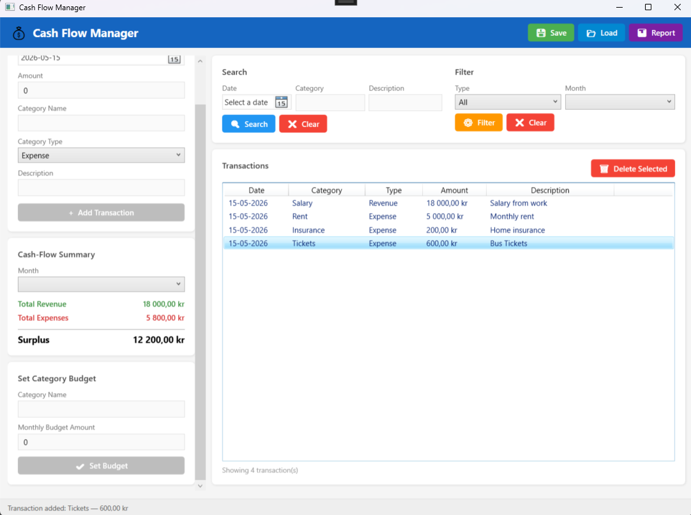
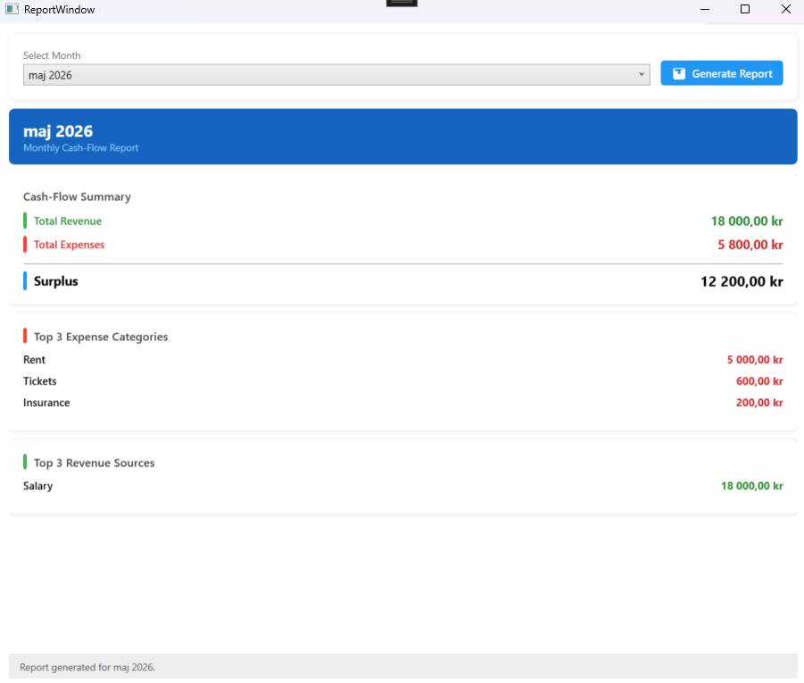

# Cash Flow Manager

A WPF desktop application for tracking personal or business monthly cash-flow,
built with C# and the MVVM pattern as part of the Programming in C# II course
at Malmö University.

## Screenshots

### Main View


### Report View


## Features

- **Add & manage transactions** — log expenses and revenues with date, amount,
  category, and description
- **Monthly cash-flow summary** — automatically calculates total revenue, total
  expenses, and net surplus/deficit per month
- **Search** — find transactions by date, category name, or description keyword
- **Filter** — filter transactions by type (Expense/Revenue) or month
- **Monthly reports** — generate a report showing top 3 expense categories,
  top 3 revenue sources, and net cash-flow
- **Save & Load** — persist transactions to a JSON file and reload them between
  sessions using a file dialog
- **Budget tracking** — set monthly spending limits per category and get warned
  when the budget is exceeded

## Project Structure
```
CashFlowManager/
│
├── Helpers/
│   ├── InverseBoolToVisibilityConverter.cs
│   └── RelayCommand.cs
│
├── Models/
│   ├── Category.cs
│   ├── CategoryType.cs
│   └── Transaction.cs
│
├── Services/
│   ├── FileService.cs
│   └── TransactionService.cs
│
├── ViewModels/
│   ├── BaseViewModel.cs
│   ├── MainViewModel.cs
│   └── ReportViewModel.cs
│
├── Views/
│   ├── MainWindow.xaml
│   ├── MainWindow.xaml.cs
│   ├── ReportWindow.xaml
│   └── ReportWindow.xaml.cs
│
├── screenshots/
│   ├── main-view.png
│   └── report-view.png   
│
├── App.xaml
├── App.xaml.cs
├── AssemblyInfo.cs
└── CashFlowManager.csproj
```
## Technologies

- **Language:** C# (.NET 9)
- **UI Framework:** WPF (Windows Presentation Foundation)
- **Architecture:** MVVM (Model-View-ViewModel)
- **Serialization:** Newtonsoft.Json
- **IDE:** Visual Studio 2022

## How to Run

1. Clone or download the repository
2. Open `CashFlowManager.sln` in Visual Studio 2022
3. Restore NuGet packages (Newtonsoft.Json)
4. Build and run with `F5`

## How to Use

### Adding a Transaction
1. Fill in the date, amount, category name, category type, and description
   in the left panel
2. Click **+ Add Transaction**

### Saving and Loading
- Click **Save** to open a file dialog and save transactions as a JSON file
- Click **Load** to open a saved JSON file and restore transactions

### Generating a Report
1. Click **Report** in the top bar
2. Select a month from the dropdown
3. Click **Generate Report** to see the top 3 expense categories,
   top 3 revenue sources, and net cash-flow summary

### Setting a Budget
1. Enter a category name and a monthly budget amount in the left panel
2. Click **Set Budget** — you will be warned automatically when that
   category exceeds the budget in any given month
## Author

Richmond Boakye  
Malmö University — Programming in C# II
